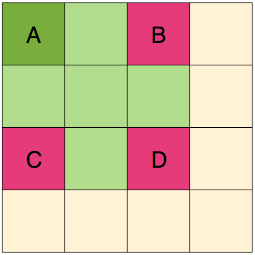

# Movement #

Character movement is a critical aspect of the game. The rules for 
movement determine how much of an area each character can explore on 
their turn as well as tactical positioning during combat.

All game play takes place on a battle map that is divided into 1x1 inch 
squares (as discussed in [Materials](#materials)). Each 1-inch square on 
the battle map represents five feet of movement. Various terrain 
features (e.g. a table, pile of rubble, wall or cliff) have vertical 
height as well as area on the map. Vertical movement is also counted as 
one square per five feet. No distinction is made between diagonal 
movement vs. movement along the rank and file of the battle map.

Walk
  : The character moves a number of squares equal to their current
    speed (base speed adjusted for bonuses and/or penalties).

Run
  : The character moves up to two squares beyond their walking speed,
    but they take a -2 penalty to all die rolls until the beginning of 
    their next turn.

Shift
  : The character can carefully move one square without being subject to
    opportunity attacks (see the [Combat](#combat) chapter for more on 
    opportunity attacks).

Fly
  : The character moves a number of squares equal to their current fly
    speed (base fly speed adjusted for bonuses and/or penalties). One 
    square of movement is also used for each 5 feet of elevation change. 
    If the character is not standing on a horizontal surface at the end 
    of their turn, they must succeed at a dt-10 skill check to avoid 
    falling. In addition, strong wind may effect their final position 
    (see [Terrain Features](#terrain-features) below).

Swim
  : A character can swim through water at their walk speed, however, the
    current may effect their final position (see [Terrain 
    Featurs](#terrain-features) below).

Stand
  : A character that is sitting or laying prone must spend an action on
    their turn to stand up before they are able to move from their 
    current square.
